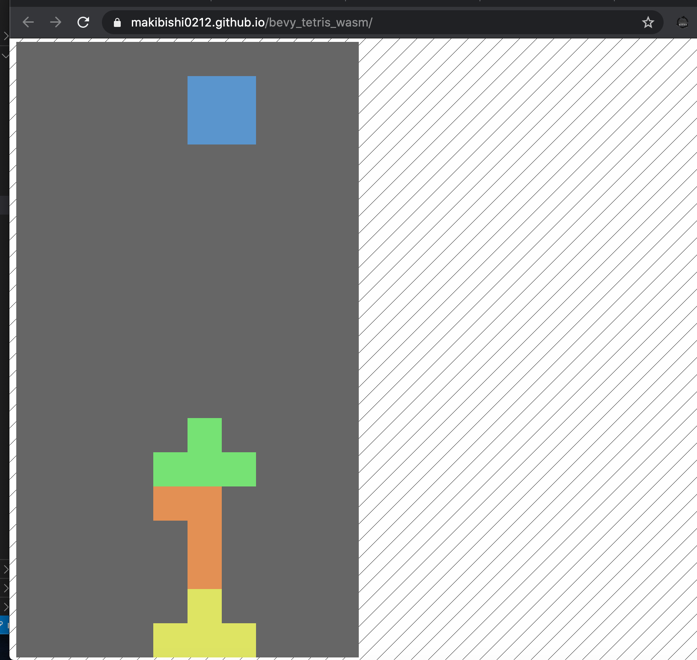

# bevy_tetris_wasm

https://makibishi0212.github.io/bevy_tetris_wasm/

## build

### Prerequisites

```
cargo install cargo-make
```

### Build and serve WASM version

```
cargo make serve
```

then point your browser to http://127.0.0.1:4000/

### Build and run native version

```
cargo make run
```


